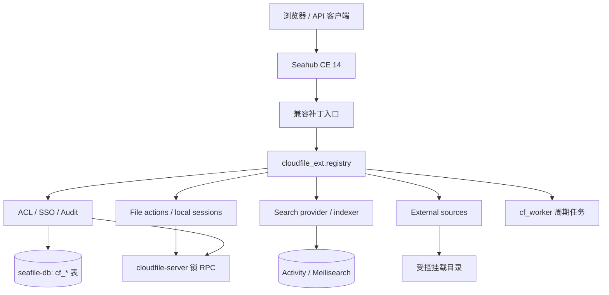

<!-- generated-by: gsd-doc-writer -->
# CloudFile Hub 架构

> 用途：说明 Hub/Web/API 的组件边界、启动注册过程和典型调用链。
> 适用版本：Seafile CE 14.x。
> 状态：已完成（架构事实已与当前 `dev` 代码核对，2026-08-11）。

## 系统概览

CloudFile Hub 采用“上游 Seahub + 进程内扩展层”的架构。原生 Seahub 继续处理身份、库/目录/文件模型、基础权限和页面；CloudFile 通过少量登记过的兼容补丁把请求导入 `cloudfile_ext`，再由注册中心把能力路由到对应模块。需要跨客户端强制执行的 ACL、锁和文件操作约束由 `cloudfile-server` 承担，本仓前端只负责展示和交互，不是安全边界。

## 组件关系



## 启动与注册生命周期

1. 部署层生成运行时 Seahub 配置，通过 `EXTRA_INSTALLED_APPS` 加载 `cloudfile_ext`；本仓只提供 [`settings_defaults.py`](../cloudfile_ext/settings_defaults.py)，不生成部署配置。
2. `CloudFileConfig.ready()` 根据 `CF_DATABASE_NAME` 建立 `cloudfile` 数据库连接并追加 `CloudFileRouter`。
3. `apps.py` 依次调用 `base`、`acl`、`sso`、`audit`、`metadata`、`search`、`checkout`、`external_sources`、`file_actions` 的 `register()`。
4. 各模块先检查自己的 `CF_ENABLE_*` 开关，再登记 URL、菜单、权限钩子、provider 或周期任务。
5. `registry.seal()` 关闭注册；启动后再次注册会抛出 `RuntimeError`。

`cloudfile_ext.office` 虽有回调保护代码和单元测试，但当前不在 `apps.py` 注册列表中，因此不属于运行时有效能力。

## 典型请求流

### 目录权限

1. Seahub 原生入口计算库/目录基础权限。
2. `seahub.views.check_folder_permission` 调用 `cloudfile_ext.hooks.check_permission()`。
3. 注册中心按顺序执行全部 `permission_check` 钩子；每个钩子只能收紧结果。
4. Hub 返回收紧后的权限；同步、WebDAV 等绕过 Hub 的路径由 `cloudfile-server` 读取同一 `cf_dir_acl` 语义强制执行。

### 搜索

1. `CF_PROVIDER_SEARCH=''` 时继续使用 CE 原生 SeaSearch/Elasticsearch 路径。
2. 选择 `meilisearch` 时，`seahub.search.utils.search_files` 委派给注册中心选中的 provider。
3. Provider 只匹配调用者已收敛的库范围；Seahub 继续补齐 repo、dirent 和虚拟库信息。
4. `cf_worker` 从 `Activity` 游标增量建立 CloudFile 自有索引。

### 本地编辑

1. 已认证用户经真实路径权限检查请求 `local-edit` 会话。
2. Hub 先向 `cloudfile-server` 获取带 generation 的强制租约，再在 `cf_edit_session` 写入一次性 ticket 摘要。
3. 本地 Agent 领取 ticket 后得到短时下载/回写 capability。
4. 回写时 Hub 重查租约 owner、kind、generation 和源文件 ID；成功后写入新版本、释放租约并关闭会话。

## 数据所有权

| 数据 | 所有者 | 本仓职责 |
|---|---|---|
| Seahub 用户、库、共享与页面状态 | CE Seahub | 复用原生模型/API |
| `cf_*` 表 | `cloudfile-server` DDL，位于 seafile-db | `managed=False` 模型与数据库路由；不得由 Django migrate 建表 |
| 文件/目录操作日志 | seafevents `Activity` | 只读查询与管理页面 |
| SeaSearch 索引 | seafevents/SeaSearch | 原生路径，不由 CloudFile 写入 |
| Meilisearch 索引 | CloudFile `cf_worker` | 增量索引、查询 provider、外部源扫描 |
| SMB/NFS 内容 | 部署侧挂载目录 | 只读浏览/下载；内容不进入 repo/commit/block 模型 |

## 目录结构

```text
cloudfile_ext/                 后端扩展及框架级测试
├── registry.py               链式扩展点和 provider 集合
├── apps.py                   启动注册与封存
├── features.py               可枚举功能开关
├── hooks.py                  上游补丁调用入口
├── management/commands/      cf_worker
├── acl/ sso/ audit/ search/  已有能力模块
├── external_sources/         外部文件源、授权、shadow API、扫描
└── file_actions/             文件动作、锁、签出和本地 Agent 会话
frontend/src/cloudfile/        CloudFile React 入口与 API 客户端
seahub/                        上游 Seahub；仅允许登记过的兼容补丁
scripts/                       上游脚本及 CloudFile 离线存储维护入口
docs/                          本仓当前文档
```

## 架构约束

- 全部开关关闭必须恢复原生 CE 行为。
- 扩展权限只能收紧，不能放宽；按钮隐藏不构成安全边界。
- 能力包的纯算法代码必须能脱离 Django、数据库和 Seafile 运行。
- 外部 HTTP 服务不得位于同步权限判定路径；数据先同步到本地再执行判定。
- 新能力优先只改 `cloudfile_ext/` 和 `frontend/src/cloudfile/`；上游改动须进入跨仓补丁登记。

## 已知架构缺口

- CloudFile `metadata` 包仍是占位注册，`checkout` 实际入口已迁入 `file_actions`。这不代表 CE 自带的 `repo_metadata`、`repo_tags`/`file_tags` 前端和 API 不存在；其可用性取决于跨仓配置和外部 Metadata Server。
- OnlyOffice 回调保护模块未接入 `CloudFileConfig.ready()`；当前有效边界仍是 CE 原生 OnlyOffice 集成。
- 本地软件前端当前读取 `session.file.name`，而会话创建响应未返回 `file`；端到端下载流程仍属部分完成。
